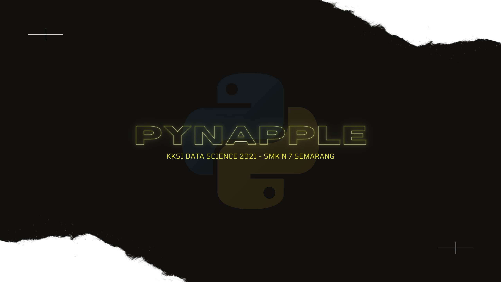
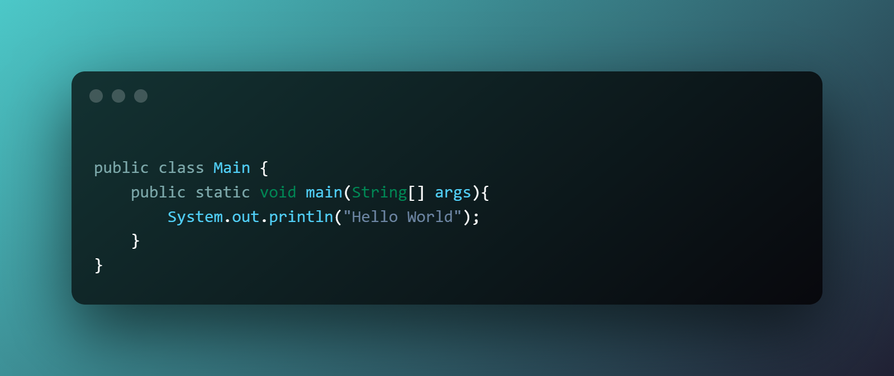
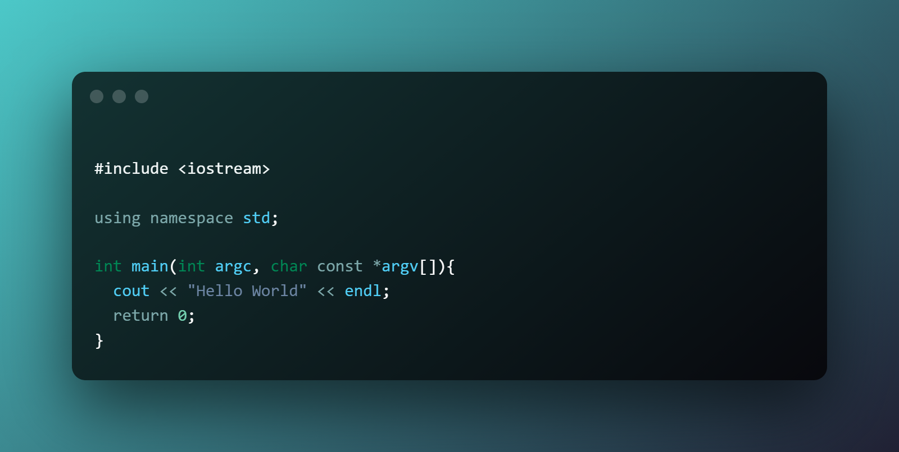
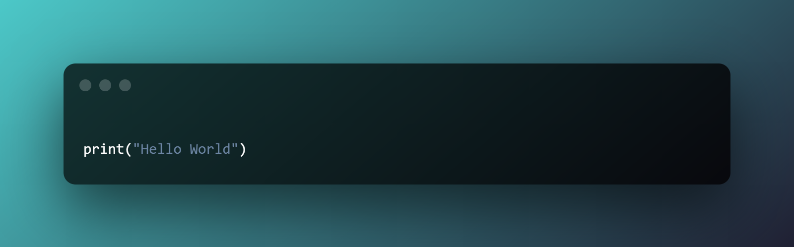

# ANIMATION EXPLAINER

1. Ardhi Putra Pradana
2. Azka Bariqlana
3. Muhammad Isya Asyhari
4. Danan Jaya Aprilian

## 1. Pembukaan

`Durasi : 5 detik `

> “Halo temen temen”
>
> “Sebelumnya apa kalian pernah atau sering dengar kata Python ?”
>
> “Kalau belum yuk simak penjelasannya”

## 2. Apa itu Python ?

`Durasi : 20 detik`

> “Python merupakan salah satu bahasa pemrograman populer tingkat tinggi, artinya Python sangat mudah dipelajari dan dibaca, karena Python mendekati bahasa manusia."
>
> "Python pertama kali dibuat dan dikembangkan pada tahun 1990 oleh **Guido Van Rossum** yang merupakan seorang programmer yang berasal dari Belanda."
>
> "Python mengalami banyak sekali perkembangan, mulai dari Python 1 yang pertama kali dirilis pada Januari 1994, hingga sekarang sudah mencapai versi Python 3 dan masih terus dikembangkan oleh **Python Software Foundation**"

## 3. Kenapa Python ?

`Durasi : 30 detik`

> "Saat ini banyak sekali orang orang yang berlomba lomba untuk mempelajari Python, karena dibanding bahasa pemrograman lainnya, penulisan kode Python jauh lebih mudah"
>
> "Di bahasa pemrograman Java ketika kita ingin menampilkan tulisan `Hello World` saja perlu menuliskan kode sebanyak ini"
>
> 

> "Sama halnya dengan bahasa C++, kita perlu menuliskan kode seperti ini untuk menampilkan tulisan `Hello World`"
>
> 

> "Beda halnya ketika kita menggunakan, untuk menampilkan tulisan `Hello World` kita hanya perlu satu baris kode saja"
>
> 

> "Selain cara penulisan kode nya yang mudah, Python juga banyak digunakan dalam bidang"
>
> - Web Development
> - Artificial Intelligence
> - Data Science
> - Machine Learning
>
> "Dan masih banyak lagi"
>
> "Gimana ? Keren bukan ?"

## 4. Dimana Python Digunakan ?

`Durasi : 20 detik`

"Saat ini sudah banyak sekali perusahaan perusahaan besar yang menggunakan Python untuk mengembangkan aplikasi nya"

"Mau tahu aplikasi apa saja yang dikembangkan menggunakan Python? berikut beberapa aplikasi yang dikembangkan menggunakan Python"

- Instagram
- Netflix
- Youtube
- Spotify

## 5. Penutup

`Durasi : 5 detik`

"Gimana ? Keren kan bahasa pemrograman Python ini ?"

"Itu dia sekilas penjelasan mengenai Python, semoga bermanfaat dan terima kasih"
